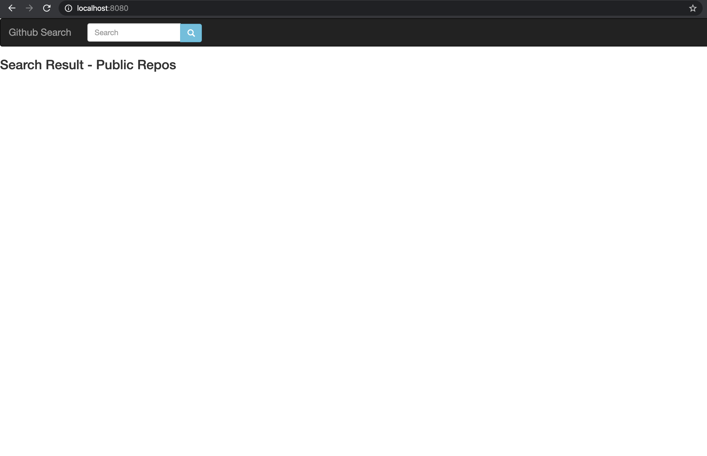
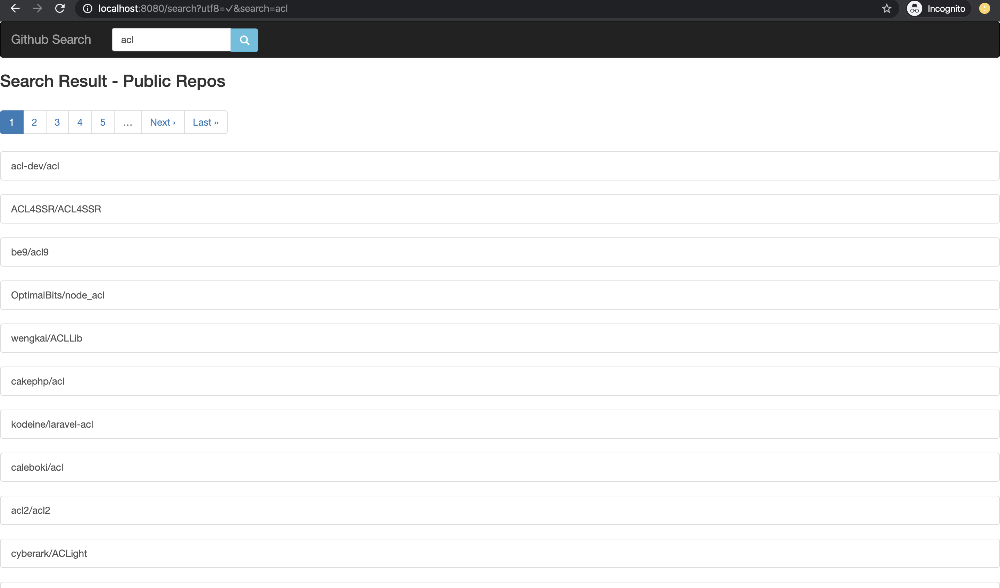

# githubRepo

### Important point about this app

1) Github search api only return first 1000 results even though total matching result are more than 1000 check below
	```
	{
	  "message": "Only the first 1000 search results are available",
	  "documentation_url": "https://developer.github.com/v3/search/"
	}
	```

2) We have added the pagination so that we dont load all the data.


### Output Example

1) (Home Page)
  

2) (Search Page)
  

### Programing Langauage & Framework used

1) Ruby 2.6.3 and Rails 5.2.3

### File structure (Where to find code)
```
-- .githubRepo
    |-- app
        |--controllers
           |--search_contoller.rb 
      
        |--services
           |--github
              |--search_service.rb  (contain business logic for getting public repositories)
    |--lib
       |--api_moduler.rb (contain rest-api method - using rest client )
       |--github_api.rb (contain code for hitting github search api)
    |--test
       |--controllers
          |--search_contoller_test.rb (contain the test for controller)
       |--services
          |--github
             |--search_service_test.rb (contain the test for search service)

    |--config
       |--routes.rb
    |-- docker-compose.yml
    |-- Dockerfile (building image)
    |-- Gemfile (contain locked dependency with version)
    |-- Gemfile.lock (contain locked dependency with version)
    |-- README.md (contain information about app like how to setup and use)

```
### How to run application
* Docker way
```
1) git clone repositories
2) Go inside dir githubRepo
3) docker-compose build
4) docker-compose up
5) hit localhost:8080
6) enjoy searching public repositories on github

```

* Normal way
```
1) Install ruby and rails with metion version
2) git clone repositories
3) cd githubRepo
4) bundle install
5) rails s
6) hit localhost:3000
7) enjoy searching public repositories on github
```
### How to run Test
```
1) Rails test
```
### Docker Containers
```
1) We have 1 docker containers
   1) For API
      CONTAINER ID        IMAGE                COMMAND                  CREATED             STATUS              PORTS                               NAMES
      81582325e92c        githubrepo_website   "/bin/sh -c 'RAILS_E…"   59 minutes ago      Up 59 minutes       0.0.0.0:8080->8080/tcp              githubrepo_website_1

```
